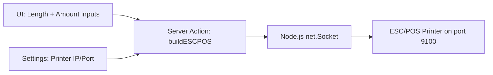
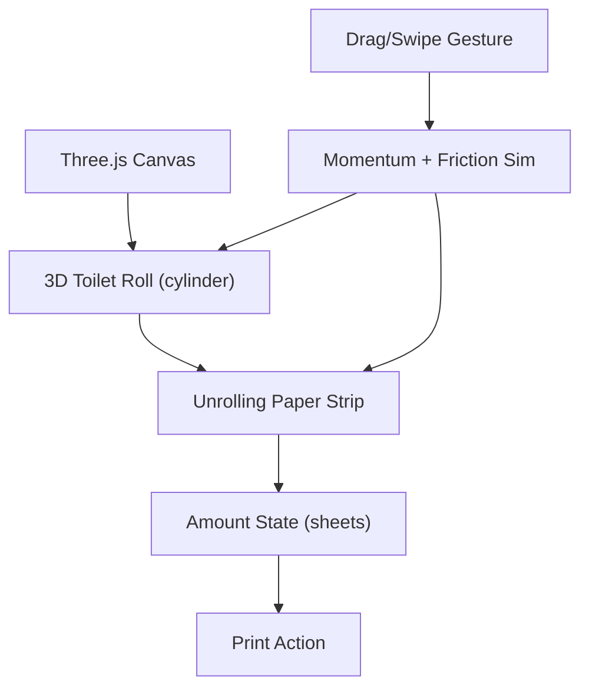

# Toilet Paper Generator

## Phase 1 — Functional Printing

### Architecture

The existing project at [toilet-paper-generator](/) is a fresh Next.js 16 + Tailwind CSS v4 + TypeScript setup. We will add:

### 1. Printer Server Action — `src/app/actions.ts`

Create a `"use server"` action that sends raw ESC/POS commands over TCP using Node.js `net` module (cross-platform, no dependency on `nc` or `lp`).

**Key approach — feed blank paper, then cut:**

- `ESC @` (0x1B, 0x40) — Initialize printer
- `ESC J n` (0x1B, 0x4A, n) — Print and feed `n` dots (0-255). Loop as needed for longer lengths.
- `GS V B 0` (0x1D, 0x56, 0x42, 0x00) — Cut paper
- Repeat the init+feed+cut sequence for the requested amount

**Length conversion:** Typical ESC/POS thermal printers run at 203 DPI, so ~80 dots/cm. For a user-requested length in cm, we calculate `dots = cm * 80` and send multiple `ESC J 255` commands followed by a remainder.

**Cross-platform:** Using Node.js `net.Socket` directly (no shell commands like `nc`) ensures it works on macOS, Windows, and Linux. This is a key improvement over the label-printer-poc which relied on `nc`.

Reference from label-printer-poc's approach in [actions.ts](src/app/actions.ts) (label-printer-poc) — we borrow the ESC/POS constants but replace the shell execution with a direct TCP socket.

### 2. Settings Context — `src/contexts/SettingsContext.tsx`

- Store `printerIp` (default `"192.168.1.56"`) and `printerPort` (default `"9100"`) in localStorage
- React Context + Provider wrapping the app in [layout.tsx](src/app/layout.tsx)
- Togglable settings panel accessible from the main page (gear icon or expandable section)

### 3. Main Page UI — `src/app/page.tsx`

Simple, clean Tailwind UI with:

- **Length input** — number input in centimeters (label: "Paper length (cm)")
- **Amount input** — number input for number of sheets (label: "Amount")
- **Print button** — calls the server action with current values and printer settings
- **Settings section** — collapsible panel at the top or bottom with IP and Port fields
- Loading/success/error states on the print button

### 4. Dependencies

No new npm packages needed for Phase 1. Node.js `net` module is built-in.

---

## Phase 2 — Interactive 3D Toilet Roll

### Architecture

Replace the simple number inputs with a Three.js 3D scene where the user physically "unrolls" toilet paper.

### 1. Install Three.js — `npm install three @react-three/fiber @react-three/drei`

- `@react-three/fiber` — React renderer for Three.js
- `@react-three/drei` — Useful helpers (OrbitControls, etc.)

### 2. Toilet Roll Component — `src/components/ToiletRoll.tsx`

- **3D Model:** A cylinder (the roll core) with a spiral/decreasing-radius outer shell representing paper layers
- **Paper strip:** A plane/ribbon geometry that extends downward as the user drags
- **Roll radius decreases** as paper is "used" — giving visual feedback of how much is left
- **Total paper length** is configurable (user sets total meters on the roll)

### 3. Physics / Interaction — `src/hooks/useRollPhysics.ts`

- Track pointer/touch drag on Y axis
- Convert drag delta to angular velocity
- Apply friction/damping so the roll keeps spinning after a swipe (momentum)
- Faster drag = faster spin = more paper unrolled
- Dragging up reverses (re-rolls the paper)
- Clamp between 0 and max paper length
- Derive "amount" (number of sheets or length in cm) from how much has been unrolled

### 4. Updated Page — `src/app/page.tsx`

- Replace the number inputs with the 3D canvas
- Show current unrolled length as an overlay / HUD
- Keep the print button and settings panel
- Keep a small manual input as fallback / fine-tuning

### 5. Responsive

- Touch events for mobile (drag to unroll)
- Mouse drag for desktop
- The 3D scene should be the hero element, centered on the page
